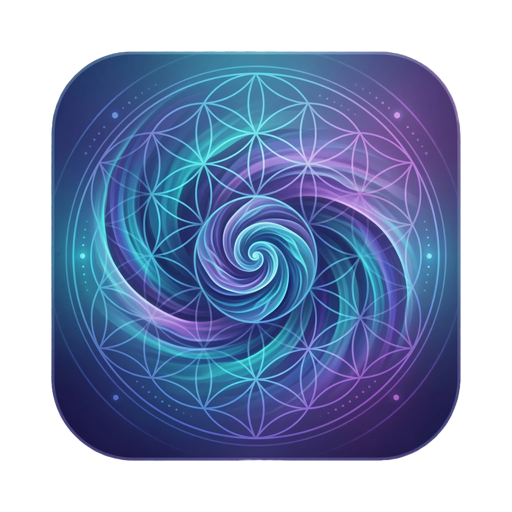
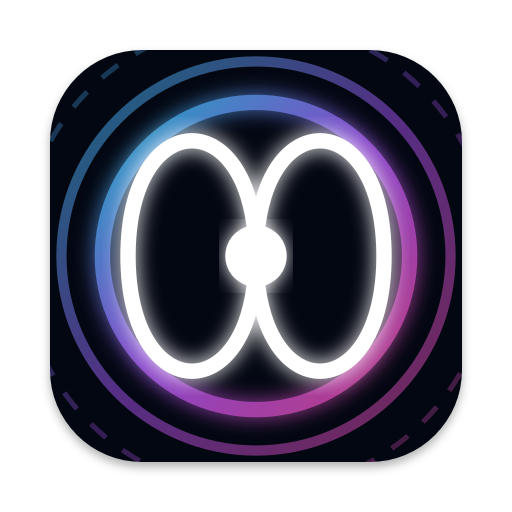
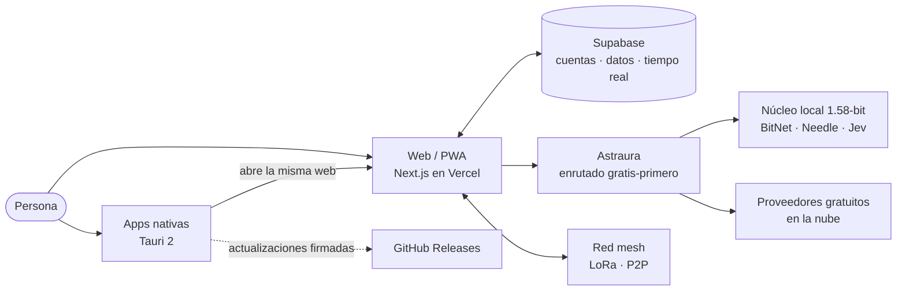

<div align="center">


# StarSeed OS

**El sistema operativo social descentralizado de la Sociedad StarSeed: democracia directa, tecnología colectiva y código abierto en una sola red.**

[](https://github.com/StarSeedSystem/starseed-system/releases/latest)
[](LICENSE)
[](https://starseed-os.vercel.app)
[-f59e0b)](#descargas)

[**Abrir en la web**](https://starseed-os.vercel.app) · [**Descargas**](#descargas) · [**Documentación**](#documentación-y-enlaces)

</div>

> **In short (English):** StarSeed OS is an open-source, decentralized *social operating system*: governance by direct democracy, education, culture, AI assistants and shared spaces, all in one place. It runs in any browser at [starseed-os.vercel.app](https://starseed-os.vercel.app) and as self-updating native apps for macOS, Windows, Linux and Android ([latest release](https://github.com/StarSeedSystem/starseed-system/releases/latest)). Built with Next.js 15, React 19, Supabase and Tauri 2. Licensed under AGPL-3.0.

---

## Qué es

StarSeed OS es un **espacio digital común** donde una comunidad decide, aprende, crea y se organiza sin intermediarios. Cada persona tiene una cuenta privada y uno o varios perfiles públicos; puede proponer y votar, publicar, abrir salas compartidas y contar con **Astraura**, una inteligencia artificial que trabaja para ti y prioriza lo gratuito y lo local.

Funciona en el navegador, se instala como app en el móvil y existe como aplicación nativa de escritorio. Es la parte digital —la «mente»— de la [Sociedad StarSeed](#documentación-y-enlaces), y su código es procomún.

## Descargas

Versión actual: **v0.2.0** (build `2026.09.24`, canal alfa). Para no quedarte con un enlace viejo, usa siempre **[la última versión](https://github.com/StarSeedSystem/starseed-system/releases/latest)**. La página [/instalar](https://starseed-os.vercel.app/instalar) detecta tu dispositivo y te recomienda el archivo adecuado.

| Sistema | Archivo | Tamaño | Cómo instalar |
|---|---|---|---|
| macOS (Apple Silicon e Intel) | [`StarSeed.OS_0.2.0_universal.dmg`](https://github.com/StarSeedSystem/starseed-system/releases/download/v0.2.0/StarSeed.OS_0.2.0_universal.dmg) | 6,7 MB | Abre el `.dmg` y arrastra StarSeed OS a Aplicaciones. |
| Windows 10/11 | [`StarSeed.OS_0.2.0_x64-setup.exe`](https://github.com/StarSeedSystem/starseed-system/releases/download/v0.2.0/StarSeed.OS_0.2.0_x64-setup.exe) | 2,4 MB | Ejecuta el instalador y sigue los pasos. |
| Windows (empresas) | [`StarSeed.OS_0.2.0_x64_en-US.msi`](https://github.com/StarSeedSystem/starseed-system/releases/download/v0.2.0/StarSeed.OS_0.2.0_x64_en-US.msi) | 3,3 MB | Instalador MSI para despliegues gestionados. |
| Linux (cualquier distro) | [`StarSeed.OS_0.2.0_amd64.AppImage`](https://github.com/StarSeedSystem/starseed-system/releases/download/v0.2.0/StarSeed.OS_0.2.0_amd64.AppImage) | 78,2 MB | `chmod +x StarSeed.OS_0.2.0_amd64.AppImage` y ábrelo. |
| Debian / Ubuntu | [`StarSeed.OS_0.2.0_amd64.deb`](https://github.com/StarSeedSystem/starseed-system/releases/download/v0.2.0/StarSeed.OS_0.2.0_amd64.deb) | 3,6 MB | `sudo apt install ./StarSeed.OS_0.2.0_amd64.deb` |
| Fedora / openSUSE | [`StarSeed.OS-0.2.0-1.x86_64.rpm`](https://github.com/StarSeedSystem/starseed-system/releases/download/v0.2.0/StarSeed.OS-0.2.0-1.x86_64.rpm) | 3,6 MB | `sudo dnf install ./StarSeed.OS-0.2.0-1.x86_64.rpm` |
| Android | [`StarSeed-os-0.2.0.apk`](https://github.com/StarSeedSystem/starseed-system/releases/download/v0.2.0/StarSeed-os-0.2.0.apk) | 27,4 MB | Abre el APK y permite «instalar apps desconocidas» si te lo pide. |
| iPhone / iPad | App web instalable | — | En Safari: **Compartir → Añadir a pantalla de inicio**. |
| Cualquier navegador | [starseed-os.vercel.app](https://starseed-os.vercel.app) | — | Sin instalar nada. También se puede instalar como PWA. |

**Primera apertura.** Los binarios de macOS y Windows todavía no están firmados por Apple ni Microsoft, así que el sistema avisará la primera vez:

- **macOS:** clic derecho sobre la app → **Abrir** → **Abrir**.
- **Windows:** en SmartScreen, **Más información → Ejecutar de todas formas**.

**Actualizaciones automáticas.** Las apps nativas (Tauri 2) buscan una versión nueva al arrancar y cada 6 horas, y solo instalan paquetes con firma verificada. La interfaz se sirve desde la web, así que las mejoras de contenido llegan sin reinstalar.

En la misma release están los instaladores de **StarSeed Nexus** y **StarSeed Café** (mismos formatos, con su nombre en el archivo).

## Funciones principales

**Comunidad y gobierno**
- **Gobernanza directa** (`/network/politics`, `/decisiones`): propuestas, votación, mediación restaurativa y gestión de recursos comunes.
- **Educación y cultura** (`/network/education`, `/network/culture`): aprendizaje, publicaciones y expresión artística.
- **Cuenta privada y perfiles públicos**: una sola cuenta con varias facetas (cívica, artística, profesional).
- **Hub, mensajes, canales y feed** para organizar comunidades.

**Inteligencia artificial: Astraura**
- **Enrutado gratis-primero**: elige sola el proveedor disponible más económico y cambia de fuente si uno se agota.
- **Núcleo local 1.58-bit**: BitNet genera, Needle decide qué herramienta usar y Jev da veredictos con probabilidad. Si corre en tu dispositivo, tus consultas no salen de él.
- Agentes, personalidades, cerebros y memorias configurables por cuenta, perfil y dispositivo.

**Tu sistema, a tu manera**
- **Puente de Mando** (`/mando`): la consola de orquestación multiagente —olas, tareas, agentes, flota de proveedores y relevo— con la que se programa StarSeed OS.
- **Biblioteca**: instala apps y recursos en la web o en cualquiera de tus **neuronas** (los dispositivos vinculados a tu cuenta), y asígnalos al perfil que quieras.
- **Escritorios, pizarras, salas 3D y XR** sincronizables para trabajar en grupo.
- **Interfaz editable por la IA**, con un núcleo intocable: lo que se comparte se revisa antes de instalarse y nunca se ejecuta código ajeno.

**Conectividad**
- **Sincronización en tiempo real** entre dispositivos (Supabase Realtime) y de archivos P2P con Syncthing.
- **Red mesh** LoRa/Meshtastic y P2P para comunicarse incluso sin internet.
- **Voz**: síntesis y reconocimiento, con motores locales cuando el dispositivo lo permite.

**Para quien desarrolla el proyecto**
- **Puente de Mando del proyecto** (`/mando`): la consola desde la que se programa StarSeed OS, con olas de tareas, agentes y proveedores en vivo. Solo funciona en la máquina del proyecto; en el despliegue público sus APIs responden 404. Más en [`PUENTE-DE-MANDO.md`](PUENTE-DE-MANDO.md).

## Ecosistema StarSeed

| | App | Qué hace | Abrir | Código |
|---|---|---|---|---|
|  | **Audiomorphic** | Convierte el sonido en geometría sagrada viva, con VR y AR. | [audiomorphic.vercel.app](https://audiomorphic.vercel.app) | [Audiomorphic-AR-app](https://github.com/StarSeedSystem/Audiomorphic-AR-app) |
|  | **Omnifrecuencias** | Generador de frecuencias con cimática 3D y sesiones en vivo. | [omnifrecuencias.vercel.app](https://omnifrecuencias.vercel.app) | [generador_frecuencias](https://github.com/StarSeedSystem/generador_frecuencias) |
|  | **StarSeed Nexus** | Portal de la marca y del ecosistema. | [starseed-nexus.vercel.app](https://starseed-nexus.vercel.app) | — |
|  | **StarSeed Café** | Espacio de encuentro de la comunidad. | [starseed-cafe.vercel.app](https://starseed-cafe.vercel.app) | — |
| | **Astraura 1.58** | Backend soberano de IA (BitNet b1.58). | [astraura.vercel.app](https://astraura.vercel.app) | [astraura](https://github.com/StarSeedSystem/astraura) |

Audiomorphic y Omnifrecuencias también funcionan **dentro** de StarSeed OS (`/audiomorphic` y `/omnifrecuencias`), con su última versión oficial; Audiomorphic puede usarse incluso como fondo animado del escritorio.

## Cómo funciona



- **Una sola interfaz.** La web (Next.js 15 + React 19) es la misma en el navegador y dentro de las apps nativas. La app nativa ([`native/`](native/README.md)) añade lo que un navegador no puede: notificaciones, arranque automático, acceso a archivos y terminal con tu permiso, y enlaces `starseed://`.
- **Datos.** Supabase gestiona autenticación, base de datos (Postgres con políticas por fila) y tiempo real.
- **Neuronas.** Cada dispositivo vinculado a tu cuenta es una «neurona»: puede alojar apps, modelos de IA y archivos, y sincronizarse con las demás.

**Stack:** Next.js 15 · React 19 · TypeScript · Tailwind CSS · shadcn/ui + Radix · Three.js / React Three Fiber · Framer Motion · Supabase · Genkit · Tauri 2 (Rust) · Vitest.

## Desarrollo local

Necesitas **Node.js 22** y npm.

```bash
git clone https://github.com/StarSeedSystem/starseed-system.git
cd starseed-system
npm install
cp .env.example .env.local   # rellena solo lo que necesites (Supabase como mínimo)
npm run dev                  # http://localhost:9002
```

Antes de proponer un cambio, pasa las tres comprobaciones que también ejecuta la CI:

```bash
npm run typecheck   # TypeScript (tsc --noEmit)
npm test            # pruebas con Vitest
npm run build       # compilación de producción (genera antes la versión)
```

Las claves van solo en `.env.local` (ignorado por git). `.env.example` lista los nombres de las variables, nunca valores.

**Apps nativas.** Requieren Rust ≥ 1.77.2 y Tauri CLI 2. Desde `native/`: `cargo tauri build` (StarSeed OS), `cargo tauri build -c tauri.nexus.conf.json` o `-c tauri.cafe.conf.json`. Guía completa en [`native/README.md`](native/README.md).

## Estructura del proyecto

```
.
├── src/
│   ├── app/            rutas (App Router): (app)/, (main)/, api/, instalar/…
│   ├── components/     interfaz: mando/, library/, trinity/…
│   ├── ai/             Astraura: enrutado, proveedores y red mesh
│   └── lib/            lógica pura: versión, biblioteca, sincronía, núcleo…
├── native/             apps nativas Tauri 2 (OS, Nexus, Café)
├── supabase/           migraciones SQL
├── scripts/            utilidades: versión, Puente de Mando, verificación
├── enjambre/           orquestación de los agentes que desarrollan el proyecto
├── architecture/       procedimientos y decisiones técnicas
├── memory/             principios, roadmap, arquitectura y bitácora
├── design-system/      sistema de diseño Liquid Crystal / Trinity
├── docs/               documentación y adendas
└── public/             iconos y recursos estáticos
```

`CLAUDE.md` y `AGENTS.md` son la memoria de trabajo para quien desarrolle con asistentes de IA.

## Privacidad y seguridad

- **Tus datos son tuyos.** La cuenta es privada; solo lo que publicas en un perfil es público. Los datos viven en Supabase, protegidos por políticas de acceso por fila.
- **Sin publicidad ni rastreadores de terceros.** El código no incluye analítica comercial.
- **IA local primero.** Con el núcleo 1.58-bit en tu dispositivo, las consultas se resuelven allí. Las claves de los proveedores en la nube están solo en el servidor, nunca en tu navegador ni en el repositorio.
- **Permisos explícitos.** La app nativa pide permiso antes de usar la terminal, archivos o notificaciones, y solo acepta actualizaciones firmadas.
- **Núcleo intocable.** Ninguna edición ni paquete compartido puede quitar la salida a Ajustes, la identidad soberana, los permisos visibles ni la integridad del voto.

¿Has encontrado una vulnerabilidad? No abras un issue público: usa **Security → Report a vulnerability** en este repositorio (si no aparece, abre un issue pidiendo un canal privado, sin detalles).

## Principios

Toda función debe pasar este filtro ([detalle](memory/principles.md)):

- Respeta la Tríada: **Ontocracia** (democracia directa), **Ciberdelia** (tecnología para expandir la conciencia, nunca para controlar) y **Transhumanismo Comunista** (abundancia y procomún).
- La persona es soberana sobre sus datos.
- Sin rastreo, publicidad ni pago para acceder a funciones democráticas.
- Código 100 % abierto; moderación restaurativa, no punitiva.
- La estética eleva a quien la usa; no lo atrapa.

## Contribuir

1. Lee [`CONTRIBUTING.md`](CONTRIBUTING.md) y [`memory/principles.md`](memory/principles.md).
2. Busca o abre un [issue](https://github.com/StarSeedSystem/starseed-system/issues); las propuestas grandes se debaten antes de programarse.
3. Crea una rama, sigue [Conventional Commits](https://www.conventionalcommits.org/es/) y pasa `typecheck`, `test` y `build`.
4. Abre un pull request explicando **qué** cambia, **por qué** y **cómo lo verificaste**.

Si añades una página, regístrala también en el dock y en el catálogo de apps: una ruta sin registrar no la ve nadie (ver `CLAUDE.md` §11).

## Hoja de ruta

- **Fase Semilla** (2026): web y PWA, los tres ecosistemas en versión mínima y apps nativas en alfa; ~100 personas.
- **Fase Fruto** (2027): federación entre nodos e infraestructura propia; ~1.000 personas.
- **Fase Cosecha** (2028+): distribución Linux propia y gratuidad sistémica; más de 10.000 personas.

Detalle en [`memory/roadmap.md`](memory/roadmap.md).

## Licencia

[AGPL-3.0-or-later](LICENSE). El código es procomún: si lo modificas y lo ofreces como servicio en red, debes publicar también tu versión.

## Documentación y enlaces

- **Web:** [starseed-os.vercel.app](https://starseed-os.vercel.app) · **Releases:** [última versión](https://github.com/StarSeedSystem/starseed-system/releases/latest)
- **Técnica:** [`architecture/`](architecture/) · [`native/README.md`](native/README.md) · [`DESPLIEGUE.md`](DESPLIEGUE.md) · [`DESIGN.md`](DESIGN.md)
- **Documentos fundacionales** (autoridad máxima del proyecto): [Constitución](https://docs.google.com/document/d/1XpltI3gkYN1Ma2wBVrlisPagL_HfeoF1RsnFKG09w4I/edit) · [Manifiesto Fundacional](https://docs.google.com/document/d/1YiX9QK_JJHbmRMRj8fXrJeNffsDQ8T2RhzMHTeyavA0/edit) · [Codex StarSeed](https://docs.google.com/document/d/1Q7ygZvMlrVD4I7nO36jC4t8ttFezw__2K_w54L6HXNc/edit) · [Documento Maestro del SOSD](https://docs.google.com/document/d/1DaX2bl8dIMSKR1yVtOHqh3iVtV_sLARMiSPFGkywa3M/edit)
- **Fundación StarSeed:** [linktr.ee/FundacionStarseed](https://linktr.ee/FundacionStarseed)
- **Propuestas sobre el propio producto:** dentro de la red, en `/network/politics`.

---

<div align="center">

*«Aquí, la tecnología sirve al espíritu. Aquí, el poder sirve a la verdad. Aquí, la vida sirve a la vida.»*
<br/>— Manifiesto Fundacional de la Sociedad StarSeed

</div>
