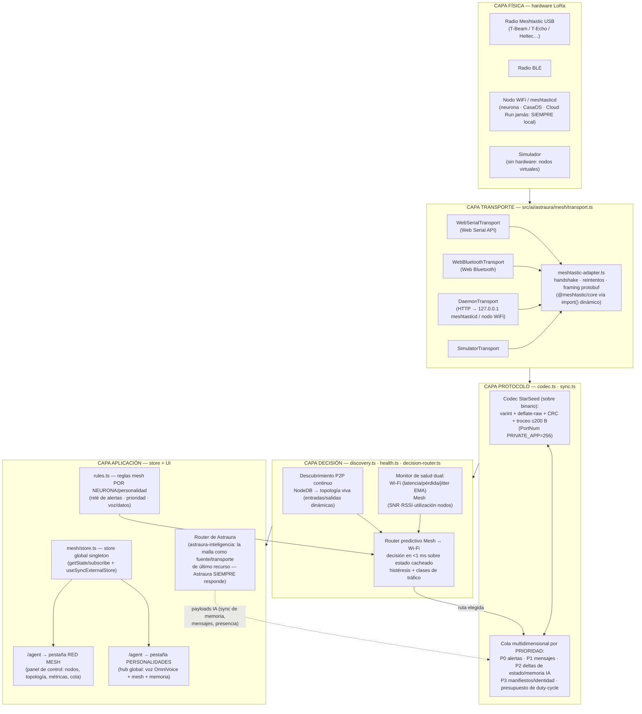
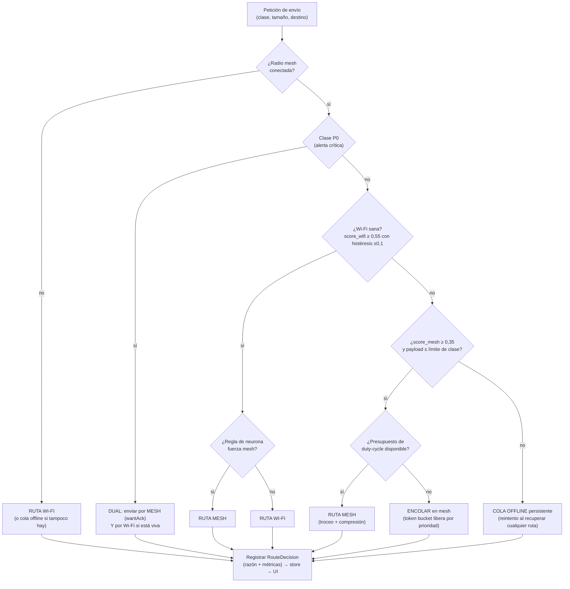

# 🕸️ SOP — Red Mesh Meshtastic en el núcleo de Astraura (Adenda 97)

> **Fuente de verdad** de la integración LoRa/Meshtastic del SOSD: comunicación
> descentralizada, resiliente y 100 % fuera de red (off-grid) para cuando la
> infraestructura tradicional falle o sea comprometida. Complementa (no
> sustituye) a `architecture/astraura-inteligencia.md`: la malla es un
> **transporte y un sentido más de Astraura**, sometido a la misma regla de oro
> — *Astraura SIEMPRE funciona, y cambia sola de fuente*.

---

## 0. Por qué (Tríada)

- **🜂 Ontocracia** — la asamblea no puede depender de un ISP. El voto, la
  alerta y el mensaje deben poder viajar de nodo a nodo sin permiso de nadie.
- **🜁 Ciberdelia** — tecnología para conectar, jamás para vigilar: LoRa emite
  por radio libre, cifrado extremo a extremo, sin operadores intermedios.
- **🜃 Transhumanismo Comunista** — infraestructura procomún: cada radio de
  ~30 € que un miembro enciende amplía la red de TODOS (cada dispositivo =
  cerebro + servidor, igual que las neuronas de Astraura).

**Invariantes que esta capa respeta** (CLAUDE.md §6): descentralización
federada, identidad soberana (las claves no salen del dispositivo), código
abierto absoluto (Meshtastic es GPL; nuestra capa es AGPL), privacidad
personal ↔ transparencia pública.

---

## 1. Qué es Meshtastic (hechos técnicos que gobiernan el diseño)

| Hecho | Valor | Consecuencia de diseño |
|---|---|---|
| Radio | LoRa (sub-GHz: EU_868 · US_915 · EU_433 …) | Alcance km, sin licencia, sin SIM |
| Topología | Malla por *managed flood routing* | No hay tablas de rutas: cada nodo reemite si `hopLimit > 0` |
| Hop limit | 3 por defecto (máx. 7; ID de 32 bits dedupe) | El "radio útil" de la malla se configura, no se descubre |
| Payload máx. | **233 B** útiles (`DATA_PAYLOAD_LEN`, antes 237; MTU 256 con cabecera de 16 B) | **Todo** lo nuestro se trocea a ≤ 200 B por frame |
| Bitrate (preset por defecto `LongFast`) | ~1,07 kbps brutos (SF11/250 kHz/CR4-5) | La malla es para **texto y deltas**, jamás blobs |
| Duty cycle legal (firmware) | EU_868 · EU_433 · TH · UA_433 = **10 %** · UA_868 = **1 %** · resto sin duty (ventana móvil de 1 h) | Presupuesto de *airtime* obligatorio (token bucket, objetivo ≤ 2 %) |
| ACK fiable | `want_ack` unicast: máx. **3 reintentos** → NAK; broadcast: ACK implícito al oír la retransmisión | Confirmación solo en clases críticas |
| Utilización de canal | ChUtil < 25 % sano · 25-50 % precaución · > 50 % problemático (ventana 1 min) | La salud mesh pondera ChUtil |
| Cifrado | AES-CTR por canal (PSK compartida) + opcional PKI nodo-a-nodo | Canal `starseed` con PSK propia; lo sensible viaja además cifrado E2E arriba |
| Descubrimiento | `NodeInfo` + telemetría periódicos → **NodeDB** en el firmware | El descubrimiento es *gratis*: escuchar, no sondear |
| Métricas de enlace | SNR/RSSI por paquete + `channelUtilization` + `airUtilTx` | Salud de malla medible sin tráfico extra |
| ACK | `wantAck` en unicast (ACK de malla); broadcast sin ACK | Confirmación selectiva solo para clases críticas |
| Puertos de app | `PortNum` (TEXT_MESSAGE_APP=1 … `PRIVATE_APP=256`) | Los sobres StarSeed viajan por `PRIVATE_APP` |
| Conexión al host | USB Web Serial · Web Bluetooth (BLE) · HTTP/TCP (nodo WiFi o `meshtasticd`) | Tres transportes + simulador, misma interfaz |
| Librería oficial JS | `@meshtastic/core` + transportes (`transport-web-serial`, `transport-web-bluetooth`, `transport-http`); legado `@meshtastic/js` | Adaptador con `import()` dinámico; la app no la exige para arrancar |

---

## 2. Arquitectura por capas



**Regla de dependencia:** cada capa solo importa hacia abajo. La UI jamás toca
el transporte directamente; todo pasa por el store y la API pública
(`src/ai/astraura/mesh/index.ts`).

---

## 3. Descubrimiento automático P2P (discovery.ts)

Meshtastic ya hace el trabajo duro: cada nodo emite `NodeInfo`/telemetría y el
firmware mantiene su **NodeDB**. Nuestro descubrimiento es **pasivo primero**
(cero coste de airtime, cero batería extra):

1. Al conectar, el adaptador pide el volcado inicial (config + NodeDB completa).
2. Cada evento (`NodeInfo`, `Position`, `Telemetry`, paquete oído) **actualiza
   el mapa vivo** `nodes: Map<nodeNum, MeshNodeInfo>` con `lastHeard`, SNR,
   RSSI, batería, rol.
3. **Entradas/salidas dinámicas**: un nodo pasa a `online` al oírlo; decae a
   `stale` (> 15 min sin oír) y `offline` (> 60 min) por *sweep* perezoso — un
   único `setInterval` de baja frecuencia (30 s) que solo recalcula estados,
   nunca transmite.
4. **Sondeo activo mínimo**: `traceroute` opcional y espaciado (≥ 15 min, solo
   con la pestaña Red Mesh abierta y utilización < 15 %) para dibujar aristas
   de topología reales.
5. Ahorro de energía: sin UI abierta, el subsistema queda en escucha pura; los
   timers largos usan `requestIdleCallback` cuando existe.

La topología resultante (nodos + aristas oídas) se publica en el store y la
pinta la UI (lista + minigrafo). Nada de esto interrumpe al usuario.

---

## 4. Enrutado inteligente Mesh ↔ Wi-Fi (decision-router.ts)

### 4.1 Métricas (health.ts)

- **Wi-Fi/Internet**: `navigator.onLine` + sonda ligera (`HEAD` al origen o a
  Supabase, timeout 3,5 s) → latencia EMA, pérdida (ventana de 10), jitter.
  Sondeo adaptativo: 20 s en degradado, 60 s en sano, inmediato ante eventos
  `online/offline`.
- **Mesh**: transporte conectado + nº de nodos `online` + `channelUtilization`
  y `airUtilTx` de la telemetría del propio radio + SNR medio de la vecindad.
- Ambas se suavizan con **EMA (α=0,3)** para evitar aleteo (flapping).

### 4.2 Puntuación

```
score_wifi = w_lat·f(latencia) + w_loss·f(pérdida) + w_stab·f(jitter)      ∈ [0,1]
score_mesh = m_link·f(SNR medio) + m_nodes·f(nodos online) + m_util·f(1-utilización)  ∈ [0,1]
```

La decisión es **por clase de tráfico**, no global:

| Clase | Ejemplos | Política |
|---|---|---|
| `P0 alert` | alertas críticas, pánico, aviso comunitario | **Ambas rutas a la vez** (mesh siempre que exista, con `wantAck`) |
| `P1 message` | mensajería corta, presencia | Mejor puntuación; mesh si Wi-Fi < umbral |
| `P2 state` | deltas de memoria IA, config, `entity_state` | Wi-Fi preferente; mesh solo como fallback (respetando airtime) |
| `P3 bulk` | manifiestos, catálogos | Solo Wi-Fi; en mesh únicamente bajo orden explícita del usuario |

### 4.3 Algoritmo (fracciones de segundo)

La evaluación corre **sobre estado cacheado** (las sondas alimentan el estado
en segundo plano): decidir = leer dos números y una histéresis → O(1), < 1 ms.



**Histéresis:** para volver de mesh a Wi-Fi se exige `score_wifi ≥ 0,65`
durante ≥ 2 sondas seguidas (evita ping-pong). Cada decisión se registra con
su razón (`wifi-degraded`, `mesh-forced-by-rule`, `duty-budget-exhausted`…) y
alimenta el **historial** visible en la pestaña Red Mesh.

---

## 5. Sincronización multidimensional de bajo ancho de banda (codec.ts · sync.ts)

### 5.1 Sobre binario StarSeed (viaja por `PRIVATE_APP=256`)

```
[0]      magic 0xA7 ("Astraura")
[1]      versión (1) · flags (deflate, cifrado-extra, ack-req)
[2..3]   msgId (16 bits, aleatorio por mensaje)
[4]      clase (P0..P3) + tipo (alert · msg · state-delta · manifest · voice-meta)
[5]      chunkIdx · [6] chunkTotal    (troceo)
[7..8]   CRC-16 del payload completo (verificación al reensamblar)
[9..]    payload (deflate-raw si flags.deflate; ≤ 191 B por trozo)
```

- **Serialización**: los objetos JSON se **filtran primero** (whitelist de
  campos críticos por tipo — jamás viaja un objeto entero "porque sí"),
  claves cortas, números como varint, y después `CompressionStream
  ('deflate-raw')` (nativo del navegador, cero dependencias). Texto español
  típico comprime 2,5–4×.
- **Deltas, no estados**: la memoria de la IA y `entity_state` sincronizan
  `hash(base) + parche` (JSON-diff plano); si el receptor no tiene la base,
  pide `full` explícitamente (pull, nunca push espontáneo de bulk).
- **Troceo y reensamblado**: ventana por `msgId`, timeout de 90 s por trozo
  perdido → NACK selectivo (`req-chunk msgId idx`) como P2, máx. 2 reintentos.
- **Presupuesto de airtime (duty cycle)**: token bucket configurado por región
  (EU_868 por defecto: 10 % ⇒ presupuesto conservador del **2 %** para
  StarSeed — la malla es de todos); cada trozo estima su airtime por el preset
  activo y consume tokens; sin tokens ⇒ la cola espera. Las P0 tienen una
  reserva propia (nunca se agotan por culpa de P2/P3).
- **Cifrado**: el canal `starseed` lleva su PSK (AES) de fábrica Meshtastic;
  los sobres marcados `cifrado-extra` van además cifrados extremo a extremo
  con la identidad soberana (la capa de permisos universales existente,
  `src/lib/sharing/access.ts`, decide QUÉ puede salir por la malla).

### 5.2 Qué sincroniza cada dimensión

| Dimensión | Contenido real | Clase | Tamaño típico tras codec |
|---|---|---|---|
| Estados de memoria IA | deltas de `aurora_conversations.meta`, resúmenes de memoria por neurona | P2 | 60–400 B |
| Configuración del entorno | claves `SYNCED_KEYS` marcadas como mesh-safe (voz por neurona, reglas mesh) | P2 | 40–200 B |
| Manifiestos de identidad | perfil público mínimo (handle, displayName, claves públicas, insignias) | P3 | 120–500 B |
| Mensajería cifrada | texto corto E2E + presencia | P1 | 30–180 B |
| Alertas | tipo + geohash corto + TTL | P0 | ≤ 60 B (1 trozo SIEMPRE) |

---

## 6. Gestión del hardware local (transport.ts · meshtastic-adapter.ts)

- **Web Serial** (USB): `navigator.serial.requestPort()` bajo gesto del
  usuario → 115200 baudios → framing Meshtastic (`0x94 0xC3 + len(2B) +
  protobuf ToRadio/FromRadio`). La librería `@meshtastic/core` +
  `@meshtastic/transport-web-serial` hace esto por nosotros; el adaptador la
  carga con `import()` dinámico (el bundle principal no crece y la app
  funciona aunque el paquete falte — modo simulador).
- **Web Bluetooth**: `navigator.bluetooth.requestDevice()` filtrando el
  servicio BLE de Meshtastic; mismo contrato de eventos.
- **Daemon local** (`meshtasticd` o nodo WiFi): HTTP hacia
  `http://127.0.0.1:<puerto>/api/…` (o la IP del nodo), estilo
  `voz local` (mismo patrón que el daemon de OpenVoice: sonda `status` +
  reintentos). Único transporte disponible sin gesto (permitido: es loopback).
- **Handshake estable**: `connect()` → volcado de config + NodeDB → `ready`.
  Watchdog de silencio (45 s sin frames → `degraded`; 90 s → reconexión).
- **Reintentos**: backoff exponencial 1→2→4→8→…→60 s (tope), con *jitter*;
  los reintentos JAMÁS piden el permiso del navegador otra vez (eso siempre
  espera un gesto del usuario); el daemon sí reintenta solo.
- **TX/RX seguros**: toda salida pasa por el codec (límites duros de tamaño);
  toda entrada valida magic + CRC + versión antes de tocar ningún estado;
  los payloads desconocidos se ignoran en silencio (nunca lanzar).
- **SSR-safe**: TODO el módulo es `"use client"`-compatible, con guardas
  `typeof navigator === "undefined"`; importar `mesh/` no toca APIs de
  navegador hasta `connect()`.

---

## 7. UI — Personalidades global + Red Mesh (Adenda 97)

### 7.1 Pestañas de `/agent` (sección antes llamada «Aurora & Astraura»)

La sección pasa a llamarse **«Personalidades»** y crece de 1 a 3 pestañas:

| value | Pestaña | Componente | Contenido |
|---|---|---|---|
| `personalidades` | **Personalidades** (nueva, por defecto) | `PersonalitiesHub` | Panel de control (KPIs: personalidades, motor de voz vivo, nodos mesh, memoria local) + `PersonalitiesPanel` global (el mismo de Exocórtex/Cerebros: archivos de personalidad completos) + **reglas mesh por neurona** + **historial de memoria local** |
| `aurora` | Estudio de voz | `AuroraStudio` | Se conserva ÍNTEGRO (deep-links `?tab=aurora` siguen funcionando) |
| `mesh` | Red Mesh | `MeshControlPanel` | Conexión de radio (Serial/BLE/daemon/simulador), nodos con métricas vivas (SNR·RSSI·batería·lastHeard), topología, historial de decisiones de ruta, cola de sync, presupuesto de airtime |

Alias de deep-link añadidos: `personalidad(es) → personalidades`,
`malla|meshtastic|lora → mesh`. `nexus-workspaces.tsx` (acceso «Personalidades»)
pasa de abrir `aurora` a abrir `personalidades`.

### 7.2 Reglas mesh POR NEURONA (rules.ts + UI en PersonalitiesHub)

Cada personalidad/neurona define de forma independiente:

- **Rol en la malla**: `interactiva` (por defecto) · `relé de alertas` (solo
  reemite P0, p. ej. una neurona-antena en una azotea) · `silenciosa` (jamás
  transmite; solo escucha) · `apagada`.
- **Prioridad de ancho de banda**: alta/normal/baja (pondera su sitio en la
  cola P1/P2).
- **Voz y datos descentralizados**: si su voz OmniVoice puede anunciar eventos
  de malla (nueva alerta oída, nodo perdido) y si sus datos (memoria/estado)
  pueden sincronizar por mesh o solo por Wi-Fi.

Persistencia: campo aditivo `mesh` en el perfil (`personalities.ts`,
retrocompatible — perfiles sin el campo = valores por defecto) + clave local
`starseed.mesh.rules.v1` para la neurona-dispositivo.

### 7.3 OmniVoice ×  xAI × OpenVoice (arreglo + expansión)

- **OpenVoice** sigue siendo el motor por DEFECTO de las personalidades
  (Adenda 93); se refuerza su cadena (descubrimiento de Spaces por sesión ya
  existente) y su transición.
- **xAI (grok-voice)** deja de ser solo la experiencia conversacional aparte:
  se añade **síntesis one-shot** (`xaiSpeakOnce`) vía el WebSocket realtime
  (texto → audio), con token efímero/procuración existentes. Entra en la
  cadena SOLO si la personalidad lo fija o el usuario lo elige (nunca pisa el
  gratis-primero por defecto), y declina limpio sin key/red → la cadena sigue.
- **OmniVoice Mixer** (`omnivoice-mixer.ts`, nuevo): salida de audio ÚNICA con
  WebAudio — **crossfade equal-power 160 ms** entre locuciones y al **cambiar
  de voz o personalidad en caliente**, cola PCM continua para streaming (xAI)
  y ganancia por neurona. Adopción v1 (honesta): lo usan la ruta híbrida
  Voicebox/OpenVoice del speak-router, el one-shot xAI y el stop global
  (fade de 120 ms en vez de corte seco). El reproductor troceado interno de
  neural-tts conserva su arranque-anticipado de la Adenda 93 y migra al mixer
  en la v2. El navegador (speechSynthesis) sigue siendo el suelo sin mixer.
- **Asignación en tiempo real**: cambiar voz/tono/cadencia de una neurona
  emite `starseed:aurora-voice-style` (ya existente) + el mixer conmuta sin
  cortar el audio en curso (la frase actual termina con su voz; la siguiente
  entra con la nueva, fundida).

---

## 8. Mapa de archivos (contratos)

```
src/ai/astraura/mesh/
  index.ts               ← API pública + startMeshSubsystem() (idempotente)
  types.ts               ← MeshNodeInfo · MeshTopology · LinkHealth · RouteDecision ·
                           TrafficClass · MeshRules · SyncItem · MeshTransportKind
  constants.ts           ← límites (payload, presets, presupuestos duty-cycle por región)
  codec.ts               ← sobre binario + deflate + troceo/reensamblado + CRC (PURO, testeable)
  transport.ts           ← interfaz MeshTransport + WebSerial/WebBluetooth/Daemon/Simulator
  meshtastic-adapter.ts  ← puente con @meshtastic/core (import() dinámico) + handshake/reintentos
  discovery.ts           ← NodeDB viva, entradas/salidas dinámicas, topología
  health.ts              ← salud dual Wi-Fi/mesh (EMA), sondas adaptativas
  decision-router.ts     ← puntuación + histéresis + clases → RouteDecision (O(1))
  sync.ts                ← colas por prioridad + token bucket airtime + deltas
  rules.ts               ← reglas mesh por neurona/personalidad (persistidas + evento)
  store.ts               ← store global (getState/subscribe/emit) SSR-safe
  use-mesh.ts            ← hooks React (useSyncExternalStore): useMeshState/useMeshNodes/…
  simulator.ts           ← nodos virtuales (demo/pruebas sin hardware)
src/components/mesh/
  mesh-control-panel.tsx ← pestaña «Red Mesh» completa
  mesh-status-chip.tsx   ← chip compacto de estado (reutilizable)
src/components/aurora/
  personalities-hub.tsx  ← pestaña «Personalidades» global (KPIs + panel + mesh + memoria)
src/lib/aurora/tts-oss/
  omnivoice-mixer.ts     ← mixer WebAudio gapless/crossfade (nuevo)
  xai-voice-agent.ts     ← + xaiSpeakOnce() (síntesis one-shot por WS)
  engine-registry.ts     ← xai como eslabón opcional de cadena (pin/elección explícita)
  speak-router.ts        ← eslabón xai + reproducción vía mixer
```

**Contratos clave** (firmas estables):

```ts
// transport.ts
export interface MeshTransport {
  readonly kind: MeshTransportKind;            // 'serial' | 'ble' | 'daemon' | 'simulator'
  connect(): Promise<void>;                    // gesto del usuario para serial/ble
  disconnect(): Promise<void>;
  send(bytes: Uint8Array, opts: MeshSendOptions): Promise<MeshSendReceipt>;
  events: MeshTransportEvents;                 // onFrame · onNodeInfo · onTelemetry · onStatus
}

// decision-router.ts
export function decideRoute(input: {
  cls: TrafficClass; sizeBytes: number; neuronRules?: MeshRules | null;
}): RouteDecision;                             // síncrono, O(1), sobre estado cacheado

// sync.ts
export function enqueueMeshSync(item: SyncItem): void;  // respeta presupuesto y prioridad

// index.ts
export function startMeshSubsystem(): void;    // idempotente, SSR-safe, coste 0 sin radio
```

---

## 9. Simulador y pruebas

- `simulator.ts` crea 4–8 nodos virtuales con SNR/batería que derivan con el
  tiempo y pérdida de paquetes configurable → la UI y el router se prueban
  SIN hardware (y es el modo demo del panel).
- `codec.ts` y `decision-router.ts` son PUROS: pruebas unitarias ejecutables
  con `tsx` (`scripts/test-mesh-core.ts`) — troceo/reensamblado con pérdida,
  CRC, presupuesto de airtime, histéresis del router.
- Verificación de compilación: `npx tsc --noEmit` + `next build` antes de
  cada deploy (DESPLIEGUE.md).

## 10. Límites honestos (v1)

- La malla NO transporta audio de voz (LoRa no da para streaming): transporta
  **metadatos de voz** (qué neurona anuncia qué) y la síntesis es local.
- Sin hardware conectado, todo queda en modo simulador/espera — coste cero.
- El puente `@meshtastic/core` requiere Chrome/Edge (Web Serial/Web Bluetooth);
  Safari/Firefox usan el transporte daemon (meshtasticd local).
- La v1 federa la NodeDB local; el intercambio de topologías entre neuronas
  StarSeed remotas (vía Supabase) queda para la v2 (campo ya previsto en
  `os_spaces`).

---

---

## 11. Adenda 98 — Mesh v2: dual, antenas inteligentes, federación, mapa 3D

Ampliación de esta ola (todo aditivo sobre §1-10; la regla de oro se mantiene):

### 11.1 Modo dual malla + router externo (simultáneos)
`connectivity.ts` guarda los ajustes de la neurona: `dualMode` (ON por defecto),
`preferred` (`auto`|`wifi`|`mesh`), transporte de radio por defecto y URL del
daemon. El `decision-router` los respeta: con ambas vías sanas, la PRESENCIA
(P1) viaja por las DOS (`dual`) en modo auto; `preferred:"mesh"` enruta a la
malla las clases permitidas aunque el Wi-Fi esté sano (sin romper la histéresis
de recuperación); P0 sigue siendo dual siempre.

### 11.2 Autodetección de banda/preset del radio
El adaptador se suscribe a `onConfigPacket` (oneof `payloadVariant.case==="lora"`)
→ región + preset reales → `index.ts` recalcula el presupuesto de duty cycle
(`initialBudget(region)`) y la estimación de airtime (`setActiveModemPreset`).
Antes el presupuesto quedaba clavado en el conservador de UNSET.

### 11.3 Antenas, bandas y SELECTOR INTELIGENTE (`antennas.ts`)
Catálogo puro de bandas por región (frecuencia/duty/potencia legales del
firmware) y presets con su compromiso alcance↔capacidad↔velocidad. `recommendPreset`
elige (o el usuario fija: distancia/equilibrio/velocidad/auto) según SNR de la
vecindad, densidad y congestión; `applyModemPreset` lo ESCRIBE al radio real
(`setConfig`+`commitEditSettings`, base = config LoRa cacheada para no pisar
región/potencia). Honestidad: solo el radio LoRa emite sin operadores; Wi-Fi/BT
son transporte y la antena celular NO es controlable desde la web.

### 11.4 Federación de topologías (`federation.ts` + migración)
Cada neurona publica (throttled) una instantánea COMPACTA de su malla a
`os_mesh_topology` (RLS por owner) y lee las de las OTRAS neuronas de la cuenta
→ `state.remoteTopologies`. Privacidad primero: `privacy.ts` gobierna
visibilidad (`account`|`private`), compartir posición (OFF por defecto),
compartir nombres, y el PERMISO DE USO del relé (`all`|`alerts`|`none`, que
manda sobre los roles). Degradación total sin sesión/tabla.

### 11.5 Centro de Conexiones + barra superior + página /red-mesh
`connections-center.tsx` (Control Center pestaña «Conexiones» + popover
`connections-menu.tsx` en la barra superior del escritorio): red externa, malla
P2P con conexión rápida por transporte, modo dual, ruta preferida, Bluetooth y
antenas. Página completa `/red-mesh` (app agregable al dock): MAPA 3D
(`mesh-map-3d.tsx`, R3F) que ubica nodos por GPS real o por ESTIMACIÓN de
distancia según SNR (`estimateDistanceMeters`) + neuronas federadas en órbita;
panel de conexiones; antenas/bandas; privacidad; peers y routers.

### 11.6 OmniVoice
El reproductor troceado de `neural-tts` ahora reproduce por el MIXER
(`playSequentialViaMixer`: crossfade real entre trozos) con HTMLAudio como
suelo. `VOICE_SYSTEM_VERSION=98` (la ventana del selector reaparece por
neurona) + `VOICE_UPDATE_NOTES` (novedades), recomendación por `device-tier`,
frase de ejemplo EDITABLE y botón «▶ Probar» por personalidad.

### 11.7 Límites honestos (v2)
- El navegador no lista redes Wi-Fi cercanas ni controla la antena celular
  (privacidad de plataforma): mostramos estado/tipo/velocidad reales.
- El mapa 3D ubica por GPS solo si el nodo comparte posición Y el usuario dio
  opt-in; el resto es distancia estimada por RF (etiquetada como tal), sin
  triangulación real (una sola antena no la permite).
- `setModemPreset` reinicia el enlace del radio unos segundos (el watchdog lo
  cubre); el firmware puede rechazar presets no legales en la región.

---

*Creado: 2026-07-27 · Adenda 97 · Ampliado: 2026-07-27 · Adenda 98 · Autor:*
*Astraura/Claude bajo dirección de Alex.*
*Regla dorada cumplida: este SOP precede/acompaña al código. Si la lógica*
*cambia, actualiza PRIMERO este documento.*
